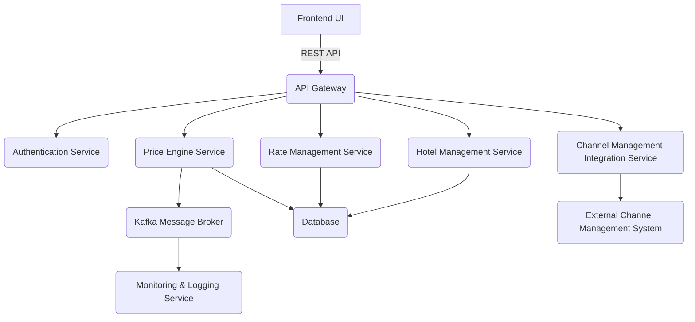
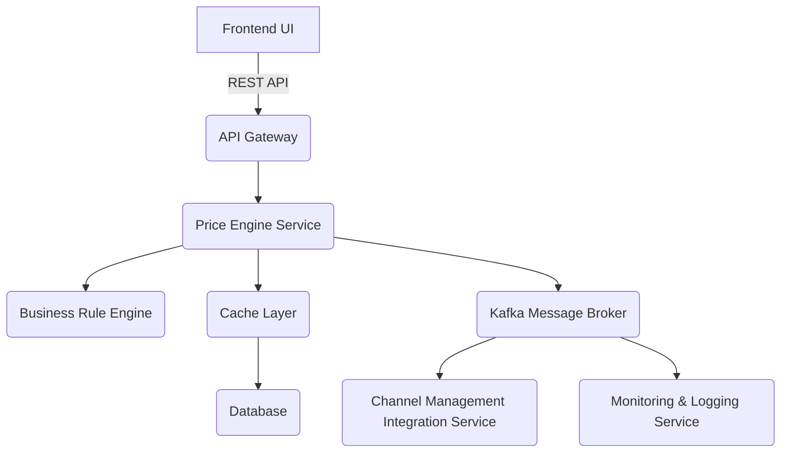
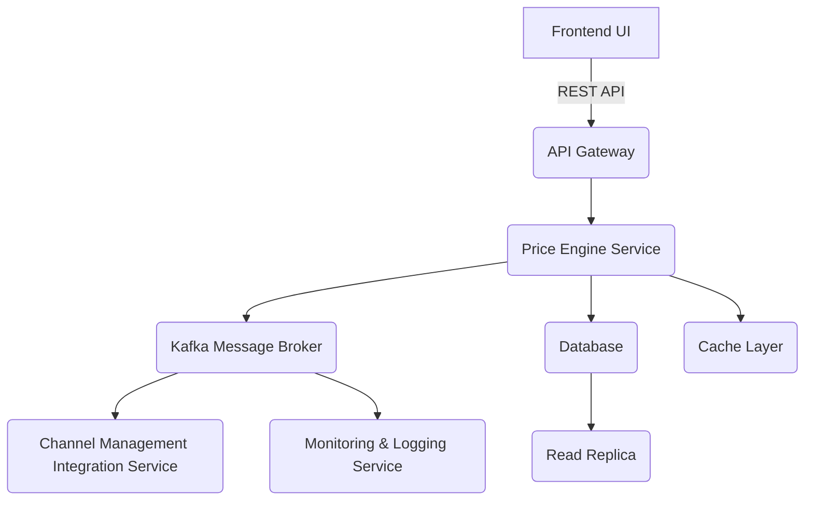
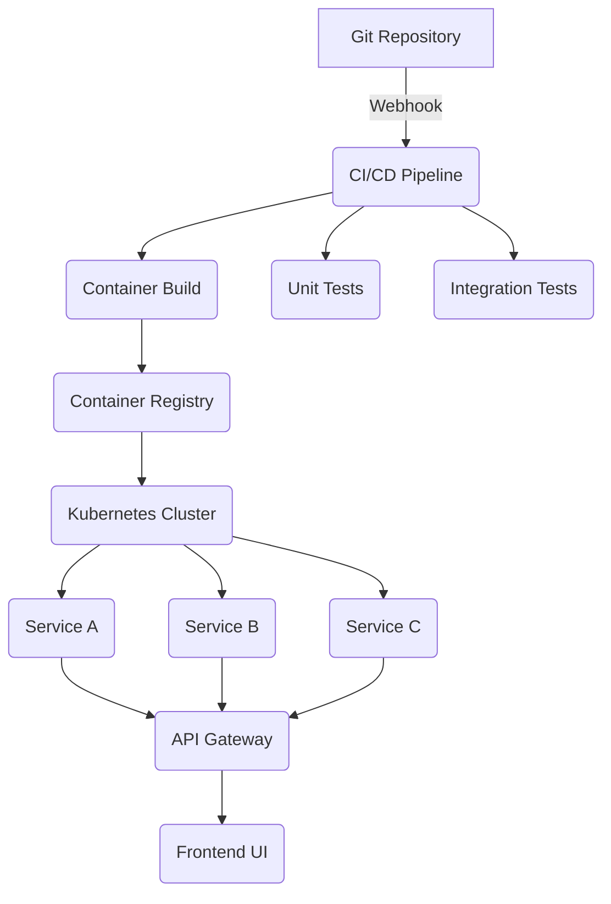

# ADD 输出结果（中文版本）

## 迭代 1：建立整体系统结构

### ADD Step 1：审查输入

#### 本轮架构驱动因素

- **用例**：HPS-1（登录）、HPS-2（修改价格）、HPS-3（查询价格）、HPS-4（管理酒店）、HPS-5（管理费率）、HPS-6（管理用户）。
- **质量属性**：
  - QA-1（性能）：客户重要性高，实现难度高。
  - QA-2（可靠性）：客户重要性高，实现难度高。
  - QA-3（可用性）：客户重要性高，实现难度高。
  - QA-4（可扩展性）：客户重要性高，实现难度高。
  - QA-5（安全性）：客户重要性高，实现难度中等。
- **架构关注点**：
  - CRN-1：建立整体初始系统结构。
  - CRN-2：利用团队在 Java 技术、Angular 框架和 Kafka 方面的知识。
  - CON-6：优先采用云原生设计。
- **约束**：
  - CON-1：用户必须通过跨平台、跨设备的 Web 浏览器访问系统。
  - CON-2：用户管理使用云提供商身份服务，资源托管在云上。
  - CON-5：初始阶段通过 REST API 与现有系统交互，未来可能支持其他协议。
  - CON-6：设计时应优先采用云原生方式。

### ADD Step 2：通过选择驱动因素建立迭代目标

本轮目标是建立 Hotel Pricing System 的整体系统结构，使其能够支持主要功能，同时处理性能、可靠性、可用性、可扩展性和安全性等关键质量属性。该结构应采用题目给定的团队熟悉技术（Java、Angular、Kafka）和云原生约束，并兼容初始 REST API 以及未来协议扩展。

### ADD Step 3：选择一个或多个系统元素进行细化

由于该项目是绿地开发，本轮选择整个系统作为细化对象。设计从系统整体出发，将其分解为主要架构组件，并让这些组件与功能需求和质量属性保持一致。

### ADD Step 4：选择满足驱动因素的设计概念

考虑的设计概念包括：

1. **单体架构**：开发简单，但在可扩展性和可修改性上不足。
2. **微服务架构**：支持可扩展性、可修改性和关注点分离，但会增加复杂度。
3. **事件驱动架构**：支持异步通信和服务解耦，有助于可靠性和可扩展性。
4. **云原生架构**：符合约束，可支持弹性、可扩展性和部署灵活性。

最终选择 **具备事件驱动能力的云原生微服务架构**。该选择与以下驱动因素对应：

- QA-1：微服务可通过水平扩展和资源独立分配支持性能。
- QA-2：事件驱动模式支持故障容忍和消息持久化。
- QA-3：云原生部署可通过冗余和故障转移支持高可用。
- QA-4：各服务可根据需求独立扩展。
- QA-5：可通过云身份服务集中处理认证与授权。
- CRN-1：提供模块化、可扩展的整体结构。
- CRN-2：利用 Java、Angular 和 Kafka。
- CON-6：符合云原生约束。

### ADD Step 5：实例化架构元素、分配职责并定义接口

1. **前端应用（Angular）**
   - 职责：提供酒店定价管理用户界面。
   - 接口：通过 REST API 与后端通信。
   - 支持约束：CON-1。

2. **认证服务**
   - 职责：通过云身份服务验证用户凭据。
   - 接口：登录与授权 REST API。
   - 支持约束：CON-2。

3. **酒店管理服务**
   - 职责：管理酒店数据，包括税率、房型和可用费率。
   - 接口：CRUD REST API。
   - 支持用例：HPS-4。

4. **费率管理服务**
   - 职责：管理费率定义和计算规则。
   - 接口：费率配置 REST API。
   - 支持用例：HPS-5。

5. **价格引擎服务**
   - 职责：基于基础价格和固定价格计算价格，支持模拟和实际价格更新。
   - 接口：价格模拟和更新 REST API。
   - 支持用例：HPS-2、HPS-3。

6. **渠道管理集成服务**
   - 职责：将更新后的价格推送到外部 Channel Management System。
   - 接口：与外部系统集成的 REST API。
   - 支持用例：HPS-2。

7. **Kafka 消息代理**
   - 职责：支持服务间异步通信。
   - 接口：用于价格变更等事件的发布/订阅模型。
   - 支持质量属性：QA-2、QA-4。

8. **监控与日志服务**
   - 职责：收集指标与日志，支持监控和调试。
   - 接口：提供可观测性仪表盘和 API。
   - 支持质量属性：QA-8、QA-9。

9. **API 网关**
   - 职责：路由请求、执行安全策略、管理限流。
   - 接口：所有客户端请求的统一入口。
   - 支持质量属性：QA-5、QA-6。

10. **数据库层**
    - 职责：持久化酒店信息、费率配置和用户权限等数据。
    - 接口：由服务通过 ORM 或查询访问。
    - 支持质量属性：QA-2、QA-3。

### ADD Step 6：绘制视图并记录设计决策

| 决策 | 理由 | 可追溯性 |
| --- | --- | --- |
| 采用云原生微服务架构 | 支持可扩展性、可靠性，并符合团队技术与约束。 | CRN-1、CRN-2、CON-6、QA-1、QA-2、QA-3、QA-4 |
| 使用 Kafka 进行事件驱动通信 | 支持异步处理和价格更新的容错。 | QA-2、QA-4 |
| 引入 API 网关 | 集中处理安全策略与请求路由。 | QA-5、QA-6 |
| 前后端分离 | 支持独立开发和部署。 | CON-1、QA-5 |
| 使用集中数据库层 | 支持数据一致性和持久化。 | QA-2、QA-3 |

### ADD Step 7：分析当前设计并评审迭代目标达成情况

本轮目标是建立整体系统结构。当前设计已将系统分解为职责清晰的模块，并定义了主要接口。云原生微服务结构和事件驱动通信可支持可扩展性、可靠性和性能要求。

下一轮将进一步细化支撑主要功能的结构，尤其是价格引擎服务及其与其他组件的交互。

### 自检

STATUS: PASS  
发现：迭代 1 的所有 ADD 步骤均已完成。系统结构已通过云原生微服务和事件驱动通信建立。设计决策可以追溯到给定用例、质量属性、架构关注点和约束，并包含 Mermaid 视图。未引入外部知识或无依据假设。

## 迭代 2：识别支撑主要功能的结构

### ADD Step 2：通过选择驱动因素建立迭代目标

本轮目标是识别并细化直接支撑主要功能的架构结构，重点关注：

- HPS-2：高效支持价格模拟与发布，并满足性能和可靠性要求。
- HPS-3：支持内部用户和外部系统的快速、可扩展价格查询。
- QA-1：价格变更应在 100 ms 内处理并发布。
- QA-4：支持最高 1,000,000 次/日查询且平均延迟下降不超过 20%。
- CRN-2：利用 Java、Angular 和 Kafka 技术知识。

本轮重点细化 **价格引擎服务** 及其与其他组件的交互。

### ADD Step 3：选择一个或多个系统元素进行细化

选择 **价格引擎服务** 作为细化对象。它是价格计算、模拟和发布的核心组件，同时需要满足严格的性能和可扩展性要求。

### ADD Step 4：选择满足驱动因素的设计概念

考虑的设计概念包括：

1. **内存缓存**：减少数据库访问并提升查询响应速度。
2. **异步处理**：将价格变更请求与实际执行解耦。
3. **批处理**：聚合多个价格更新以优化资源使用。
4. **CQRS**：分离读写模型以优化性能和可扩展性。
5. **限流与节流**：控制 API 流量，避免系统过载。
6. **事件溯源**：保留价格变更历史，便于审计和追溯。

最终选择 **CQRS、内存缓存和通过 Kafka 的异步事件处理** 的组合。该组合支持：

- QA-1：CQRS 优化读写路径，缓存降低延迟。
- QA-4：读模型与写模型可独立扩展。
- QA-2：事件记录和 Kafka 持久化支持可靠性。
- CRN-2：利用团队熟悉的 Java/Kafka。

### ADD Step 5：实例化架构元素、分配职责并定义接口

#### 1. 价格引擎服务（细化）

- 职责：接收价格变更命令；使用业务规则模拟价格变更；发布实际价格变更到渠道管理系统；维护事件日志用于审计和重放。
- 接口：价格更新 REST API；Kafka 价格变更主题；内部异步处理队列。
- 支持质量属性：QA-1、QA-2、QA-4。

#### 2. 价格查询服务

- 职责：提供当前价格数据的快速访问，支持按酒店、日期、房型等维度查询。
- 接口：价格查询 REST API；可为未来灵活查询扩展新端点。
- 支持质量属性：QA-4、QA-1。

#### 3. 业务规则引擎

- 职责：应用费率计算逻辑，例如税费、折扣等；验证价格约束。
- 接口：内部规则评估 API；规则定义存储在数据库中。
- 支持质量属性：QA-1、QA-9。

#### 4. 缓存层

- 职责：在内存中保存高频访问价格数据；价格变化时使缓存失效。
- 接口：内部缓存读写 API；监听 Kafka 事件进行失效处理。
- 支持质量属性：QA-1、QA-4。

### ADD Step 6：绘制视图并记录设计决策

| 决策 | 理由 | 可追溯性 |
| --- | --- | --- |
| 为价格引擎采用 CQRS | 分离读写模型，优化性能与扩展性。 | QA-1、QA-4 |
| 使用内存缓存 | 降低高频价格查询延迟。 | QA-1、QA-4 |
| 通过 Kafka 进行异步事件处理 | 支持可靠交付与解耦。 | QA-2、QA-4 |
| 增加业务规则引擎 | 集中并模块化费率计算逻辑。 | HPS-2、QA-1 |
| 引入专用价格查询服务 | 支持独立扩展和更快查询响应。 | QA-4、QA-1 |

### ADD Step 7：分析当前设计并评审迭代目标达成情况

本轮已细化支撑价格管理和价格查询的关键结构。价格引擎服务、业务规则引擎、缓存层和价格查询服务直接支持 HPS-2 与 HPS-3，并面向性能、可扩展性和可靠性进行设计。

下一轮将聚焦可靠性与可用性，包括容错、冗余和监控策略。

### 自检

STATUS: PASS  
发现：迭代 2 覆盖了全部要求步骤。迭代目标与 HPS-2、HPS-3、QA-1、QA-4 一致。价格引擎服务被正确选择为细化对象，CQRS、缓存和 Kafka 等设计概念与驱动因素对应。架构元素职责和接口清晰，包含 Mermaid 视图，且未引入外部知识或无依据假设。

## 迭代 3：处理可靠性和可用性质量属性

### ADD Step 2：通过选择驱动因素建立迭代目标

本轮目标是处理 QA-2（可靠性）和 QA-3（可用性），设计容错和高可用结构，确保：

- 价格变更 100% 成功发布并被渠道管理系统接收。
- 维护窗口之外，价格查询达到 99.9% 可用性 SLA。
- 关键组件（价格引擎服务、Kafka、外部集成）发生故障时系统具备恢复能力。

### ADD Step 3：选择一个或多个系统元素进行细化

本轮选择以下元素进行细化：

1. 价格引擎服务。
2. Kafka 消息代理。
3. 渠道管理集成服务。
4. 监控与日志服务。

这些组件对系统可靠性和可用性至关重要。

### ADD Step 4：选择满足驱动因素的设计概念

考虑的设计概念包括：

1. **冗余与故障转移**：关键服务部署多个实例并自动切换。
2. **消息持久化与重试**：确保消息保存和失败重试。
3. **健康检查与自恢复**：通过健康检查和自动重启提升可用性。
4. **断路器模式**：隔离故障组件，避免级联失败。
5. **分布式追踪与监控**：提供端到端可见性。
6. **数据库复制与读副本**：提升数据库可用性并降低读延迟。

最终选择 **冗余、消息持久化、健康检查和分布式追踪** 的组合，以满足 QA-2 与 QA-3。

### ADD Step 5：实例化架构元素、分配职责并定义接口

#### 1. 价格引擎服务（增强）

- 职责：以集群模式运行多个副本；在价格模拟或发布故障时使用断路器隔离故障；外部系统不可用时支持降级。
- 接口：具有限流和超时控制的 REST API；供负载均衡器使用的健康检查端点。
- 支持质量属性：QA-2、QA-3。

#### 2. Kafka 消息代理（增强）

- 职责：主题配置多副本；启用消息保留策略和失败消息死信队列。
- 接口：带确认和重试逻辑的生产者/消费者 API；主题健康和消费延迟监控。
- 支持质量属性：QA-2、QA-3。

#### 3. 渠道管理集成服务（增强）

- 职责：使用指数退避重试失败集成；在外部系统不可用时将待处理更新保存在持久队列中。
- 接口：与外部系统集成的 REST API；内部待处理更新队列。
- 支持质量属性：QA-2、QA-3。

#### 4. 监控与日志服务（增强）

- 职责：集中收集服务日志；监控健康状态并告警；跟踪延迟、成功率和错误数等指标。
- 接口：指标端点和实时监控仪表盘。
- 支持质量属性：QA-8、QA-3。

### ADD Step 6：绘制视图并记录设计决策

| 决策 | 理由 | 可追溯性 |
| --- | --- | --- |
| 价格引擎服务集群化部署 | 提升可用性和容错能力。 | QA-3、QA-2 |
| Kafka 主题复制和死信队列 | 避免数据丢失，并支持消息恢复。 | QA-2、QA-3 |
| 渠道集成服务使用指数退避和重试 | 保证价格变更最终交付。 | QA-2 |
| 数据库读副本 | 提升查询性能和可用性。 | QA-3 |
| 集中监控和分布式追踪 | 支持早期发现和处理问题。 | QA-8、QA-3 |

### ADD Step 7：分析当前设计并评审迭代目标达成情况

本轮已通过集群部署、消息持久化、重试机制和监控能力增强系统可靠性与可用性。设计直接支持“价格变更可靠发布”和“价格查询 99.9% 可用性”的质量目标。

下一轮将处理开发与运维关注点，包括持续部署、可测试性和可修改性。

### 自检

STATUS: PASS  
发现：迭代 3 的全部 ADD 步骤均已完成。通过对关键组件增加容错设计，达成了可靠性和可用性目标。设计决策可以追溯到 QA-2 和 QA-3，包含 Mermaid 视图，未引入外部知识或无依据假设。

## 迭代 4：处理开发与运维

### ADD Step 2：通过选择驱动因素建立迭代目标

本轮目标是处理开发与运维关注点，具体包括：

- CRN-3：支持将工作分配给开发团队成员。
- CRN-4：避免技术债，保持关注点清晰分离。
- CRN-5：建立持续部署基础设施。
- QA-6：支持不修改核心组件即可新增其他协议端点。
- QA-7：支持在非生产环境之间迁移时无需修改代码。
- QA-9：支持与外部系统隔离的集成测试。

本轮聚焦 **CI/CD 流水线、模块化策略、测试基础设施和环境配置管理**。

### ADD Step 3：选择一个或多个系统元素进行细化

选择以下元素进行细化：

1. CI/CD 流水线。
2. 服务模块化策略。
3. 测试基础设施。
4. 环境配置管理。

这些元素直接支持可部署性、可测试性和可修改性。

### ADD Step 4：选择满足驱动因素的设计概念

考虑的设计概念包括：

1. **基础设施即代码（IaC）**：用声明式配置定义云资源。
2. **容器化**：使用容器和集群部署保持环境一致。
3. **模块化单仓库**：将微服务组织在一个仓库中，并包含共享库。
4. **自动化测试框架**：实现单元、集成和端到端测试。
5. **功能开关**：支持安全发布。
6. **多阶段构建**：在 CI/CD 中分离构建、测试和部署阶段。

最终选择 **容器化、模块化单仓库、自动化测试和多阶段 CI/CD 流水线** 的组合。该组合支持：

- CRN-3：各服务可独立开发和部署。
- CRN-4：职责清晰，减少重复和技术债。
- CRN-5：自动化流水线提供快速反馈和交付。
- QA-6：可通过新增端点支持协议扩展，而不影响核心组件。
- QA-7：环境差异通过配置管理处理。
- QA-9：支持多层级自动化测试。

### ADD Step 5：实例化架构元素、分配职责并定义接口

#### 1. CI/CD 流水线

- 职责：自动构建、测试和部署；部署前执行质量门禁；与 Git 平台集成。
- 接口：Git webhook 触发流水线；容器镜像仓库；部署脚本。
- 支持质量属性：QA-7、CRN-5。

#### 2. 服务模块化策略

- 职责：每个微服务独立开发和部署；共享库版本化并发布到内部制品仓库；服务通过明确 API 和事件通信。
- 接口：REST/未来协议 API；内部制品仓库。
- 支持质量属性：QA-6、CRN-3。

#### 3. 测试基础设施

- 职责：为外部依赖提供 mock 服务；自动运行单元、集成和端到端测试；生成覆盖率报告并设置阈值。
- 接口：测试框架；用于模拟 Channel Management System 的 mock server；API 集成测试套件。
- 支持质量属性：QA-9、CRN-4。

#### 4. 环境配置管理

- 职责：存储环境特定设置，如凭据和 URL；运行时注入配置；支持 dev、staging、prod 等环境。
- 接口：安全配置存储；通过环境变量或配置映射注入服务。
- 支持质量属性：QA-7、CRN-5。

### ADD Step 6：绘制视图并记录设计决策

| 决策 | 理由 | 可追溯性 |
| --- | --- | --- |
| 容器化部署 | 支持跨环境一致部署。 | QA-7、CRN-5 |
| 模块化单仓库和共享库 | 支持独立开发，同时减少重复。 | CRN-3、CRN-4 |
| 多阶段 CI/CD 流水线 | 支持质量门禁和快速反馈。 | CRN-5、QA-9 |
| 使用 mock 的自动化测试 | 隔离外部依赖，支持集成测试。 | QA-9、CRN-4 |
| 通过 IaC/配置管理环境差异 | 避免手工配置漂移。 | QA-7、CRN-5 |

### ADD Step 7：分析当前设计并评审迭代目标达成情况

本轮通过 CI/CD 流水线、模块化架构、自动化测试和环境配置管理处理了开发与运维关注点。模块化单仓库支持团队协作和职责分配，容器化与配置管理支持可部署性，mock 和自动化测试支持可测试性。

由于这是固定计划中的最后一轮，整体架构设计已经完成，可进入实现阶段。

### 自检

STATUS: PASS  
发现：迭代 4 的全部 ADD 步骤均已完成。通过细化 CI/CD 流水线、模块化策略、测试基础设施和环境配置管理，达成了开发与运维目标。设计决策可以追溯到 CRN-3、CRN-4、CRN-5 以及 QA-6、QA-7、QA-9，包含 Mermaid 视图，未引入外部知识或无依据假设。
