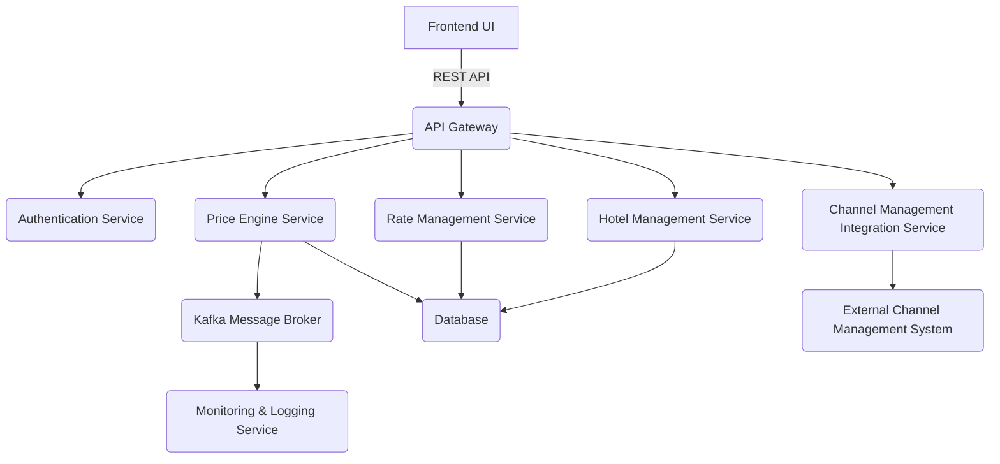
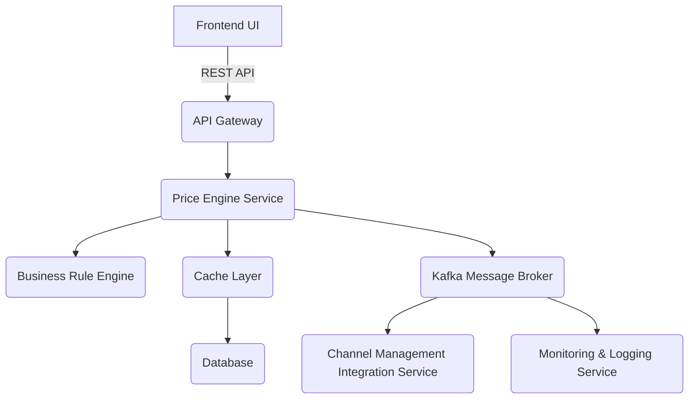
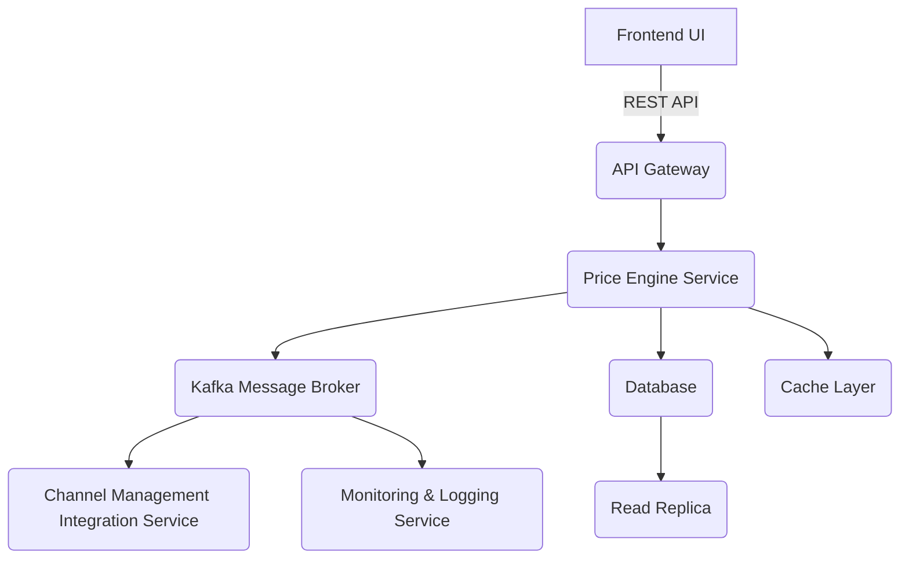
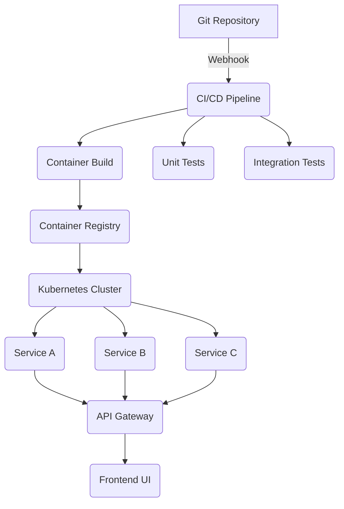

# 报告草稿（中文版本）

## 一、ADD 输出结果

### 1. 迭代 1：建立整体系统结构

#### ADD Step 1：审查输入

本轮主要驱动因素包括所有主要用例 HPS-1 到 HPS-6，以及性能、可靠性、可用性、可扩展性和安全性等关键质量属性。架构关注点包括建立整体系统结构、利用团队熟悉的 Java/Angular/Kafka 技术，以及优先采用云原生设计。约束包括 Web 浏览器访问、云身份服务、初始 REST API 交互和云原生方式。

#### ADD Step 2：建立迭代目标

目标是建立 Hotel Pricing System 的整体系统结构，使其支持主要功能并处理关键质量属性。设计需要符合 Java、Angular、Kafka 和云原生约束，并为未来协议扩展保留空间。

#### ADD Step 3：选择细化元素

由于该项目是绿地开发，选择整个系统作为细化对象，并将系统分解为多个主要架构组件。

#### ADD Step 4：选择设计概念

比较单体架构、微服务架构、事件驱动架构和云原生架构后，选择具备事件驱动能力的云原生微服务架构。该方案可同时支持性能、可靠性、可用性、可扩展性、安全性和云原生约束。

#### ADD Step 5：实例化元素、职责和接口

系统由前端应用、认证服务、酒店管理服务、费率管理服务、价格引擎服务、渠道管理集成服务、Kafka 消息代理、监控与日志服务、API 网关和数据库层组成。各组件通过 REST API、事件和持久化接口协作。

#### ADD Step 6：视图和设计决策

关键决策包括采用云原生微服务架构、使用 Kafka 进行事件驱动通信、引入 API 网关、前后端分离和集中数据库层。这些决策分别追溯到 CRN-1、CRN-2、CON-6、QA-1、QA-2、QA-3、QA-4、QA-5 和 QA-6。

#### ADD Step 7：分析

本轮建立了整体系统结构，组件职责清晰，接口关系明确，能够支撑主要功能和关键质量属性。下一轮继续细化支撑主要功能的结构。

### 2. 迭代 2：识别支撑主要功能的结构

#### ADD Step 2：建立迭代目标

本轮目标是细化支撑 HPS-2（修改价格）和 HPS-3（查询价格）的架构结构，重点满足 QA-1（性能）和 QA-4（可扩展性），同时利用团队在 Java、Angular 和 Kafka 上的经验。

#### ADD Step 3：选择细化元素

选择价格引擎服务作为细化对象，因为它负责价格计算、模拟和发布，是系统核心功能的中心。

#### ADD Step 4：选择设计概念

考虑内存缓存、异步处理、批处理、CQRS、限流和事件溯源后，选择 CQRS、内存缓存和通过 Kafka 的异步事件处理。该组合支持读写分离、低延迟查询、可靠事件发布和独立扩展。

#### ADD Step 5：实例化元素、职责和接口

细化后的结构包括价格引擎服务、价格查询服务、业务规则引擎和缓存层。价格引擎接收价格变更命令并发布事件；价格查询服务提供快速查询；业务规则引擎集中执行价格计算规则；缓存层降低数据库访问压力。

#### ADD Step 6：视图和设计决策

关键决策包括为价格引擎采用 CQRS、使用内存缓存、通过 Kafka 异步事件处理、增加业务规则引擎和专用价格查询服务。这些决策追溯到 HPS-2、HPS-3、QA-1、QA-2 和 QA-4。

#### ADD Step 7：分析

本轮细化了直接支撑价格变更和价格查询的核心结构。设计能够支持性能、可扩展性和可靠性目标。下一轮处理可靠性和可用性。

### 3. 迭代 3：处理可靠性和可用性质量属性

#### ADD Step 2：建立迭代目标

本轮目标是处理 QA-2 和 QA-3，确保价格变更 100% 成功发布并被渠道管理系统接收，同时价格查询在维护窗口之外达到 99.9% 可用性。

#### ADD Step 3：选择细化元素

选择价格引擎服务、Kafka 消息代理、渠道管理集成服务和监控与日志服务作为细化对象。

#### ADD Step 4：选择设计概念

考虑冗余与故障转移、消息持久化与重试、健康检查与自恢复、断路器、分布式追踪与监控、数据库复制与读副本后，选择冗余、消息持久化、健康检查和分布式追踪的组合。

#### ADD Step 5：实例化元素、职责和接口

价格引擎服务以集群模式运行并使用断路器；Kafka 启用复制、保留策略和死信队列；渠道管理集成服务使用重试和持久队列；监控与日志服务收集健康、延迟、成功率和错误指标。

#### ADD Step 6：视图和设计决策

关键决策包括价格引擎集群化、Kafka 复制和死信队列、渠道集成重试、数据库读副本以及集中监控和分布式追踪。这些决策追溯到 QA-2、QA-3 和 QA-8。

#### ADD Step 7：分析

本轮通过冗余、消息持久化、重试和监控满足可靠性与可用性目标。下一轮处理开发与运维。

### 4. 迭代 4：处理开发与运维

#### ADD Step 2：建立迭代目标

本轮目标是处理团队分工、技术债、持续部署、可修改性、可部署性和可测试性等关注点。

#### ADD Step 3：选择细化元素

选择 CI/CD 流水线、服务模块化策略、测试基础设施和环境配置管理作为细化对象。

#### ADD Step 4：选择设计概念

考虑基础设施即代码、容器化、模块化单仓库、自动化测试、功能开关和多阶段构建后，选择容器化、模块化单仓库、自动化测试和多阶段 CI/CD 流水线。

#### ADD Step 5：实例化元素、职责和接口

CI/CD 流水线负责自动构建、测试和部署；模块化策略支持服务独立开发和共享库管理；测试基础设施通过 mock 隔离外部依赖；环境配置管理通过运行时配置支持环境迁移。

#### ADD Step 6：视图和设计决策

关键决策包括容器化部署、模块化单仓库、多阶段 CI/CD、带 mock 的自动化测试，以及通过 IaC/配置管理环境差异。这些决策追溯到 CRN-3、CRN-4、CRN-5、QA-6、QA-7 和 QA-9。

#### ADD Step 7：分析

本轮完成开发与运维相关结构设计。由于这是固定计划中的最后一轮，整体架构设计已完成，可进入实现阶段。

## 二、交互成本分析

| 项目 | 值 |
| --- | --- |
| 完成作业的方式 | 单 Agent（顺序推理 + 自我反思） |
| 使用的大语言模型 | Qwen3-32B |
| 人类交互次数 | 人工运行程序 1 次；LLM API 调用 8 次 |
| Token 消耗 | API 元数据中未返回 token usage，因此程序记录为 null |
| 时间成本 | 约 3 分 6 秒（根据日志中 8 次调用耗时合计估算） |

## 三、个人反思

### 1. 遇到的问题和采用的解决方案

本项目在实现过程中需要确保单 Agent 严格使用题目提供的 ADD 3.0 方法和 Hotel Pricing System 案例材料。为避免引入外部知识，系统提示词中明确限制 Agent 只能使用提供的 prior knowledge，并要求所有设计决策追溯到题目中的用例、质量属性、关注点或约束。

运行过程中还遇到 API Key 配置、CLI 应用误启动 Web Server、DashScope 请求超时等问题。解决方案包括使用环境变量提供 API Key、将 Spring Boot 应用类型设置为非 Web、为 DashScope HTTP 调用配置更长的读取超时，并关闭模型隐藏 thinking 以降低延迟。单 Agent 的自我反思仍然通过独立的 self-reflection 调用完成。

### 2. 小组个人贡献

| 姓名（中文） | 贡献 |
| --- | --- |
|  | 搭建 Spring Boot + Spring AI Alibaba 单 Agent 程序，配置 Qwen3-32B API 接入。 |
|  | 整理 PDF 中的 ADD 3.0 和 Hotel Pricing System 先验知识。 |
|  | 设计四轮 ADD 自动执行流程和 self-reflection 机制。 |
|  | 生成对话日志、ADD 输出和报告草稿，并进行中文版本整理。 |
